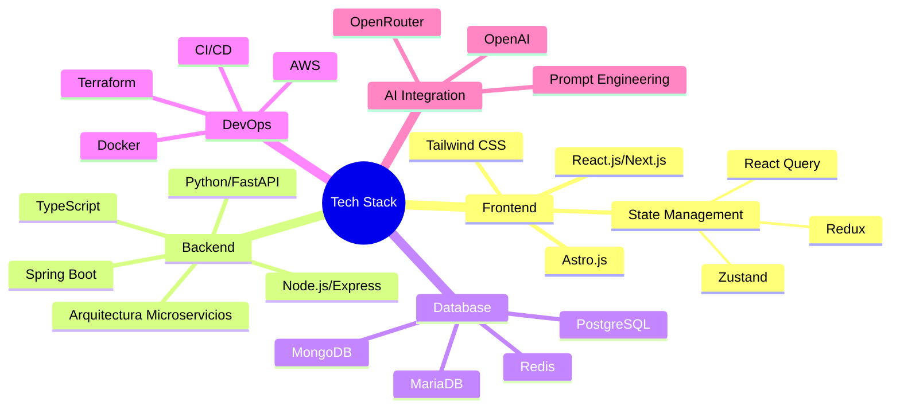
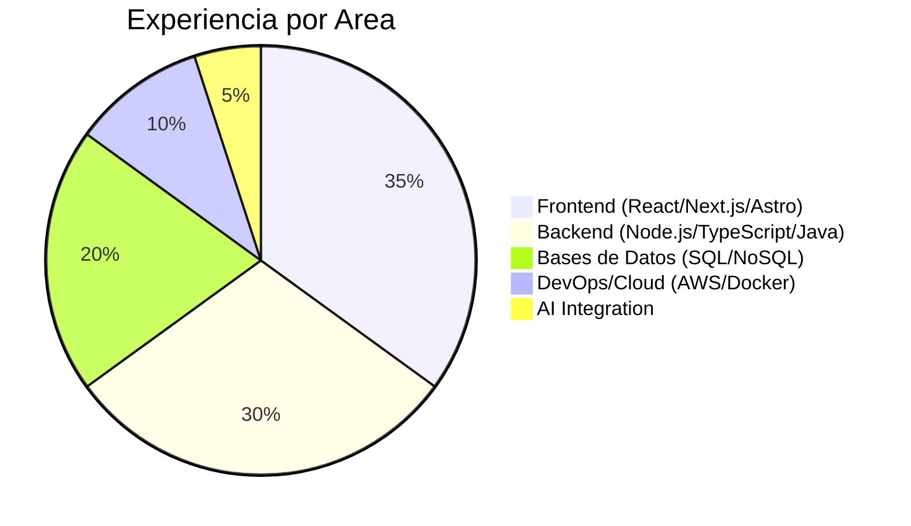
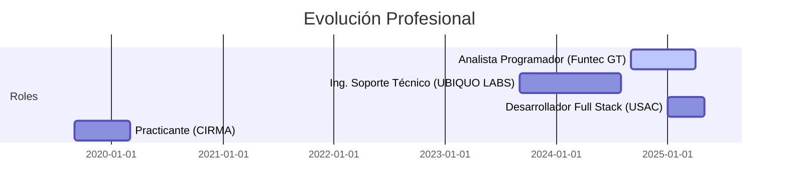

  <h1>José E. Galdámez | Full Stack Developer 👨‍💻</h1>
  
🚀 Full Stack Developer | 🎓 Ingeniería en Ciencias y Sistemas (9º Semestre) | 💻 Especialista en Arquitecturas Modernas

  
  <!-- Badges de tecnologías principales - actualizadas -->
  

    
    
    
    
    
  

  <!-- GitHub Stats Cards -->
  

    
    
  

## 💡 Sobre Mí 
Desarrollador Full Stack con más de 2 años de experiencia profesional construyendo aplicaciones web escalables y de alto rendimiento. Especializado en arquitecturas de microservicios, API RESTful y desarrollo frontend moderno. Actualmente cursando el 9º semestre de Ingeniería en Ciencias y Sistemas, complementando mi sólida formación académica con amplia experiencia práctica tanto en frontend como backend.

Mi enfoque se centra en crear soluciones robustas y eficientes, aplicando patrones de diseño avanzados y prácticas de código limpio. Apasionado por las nuevas tecnologías y metodologías ágiles, me mantengo constantemente actualizado con las tendencias de la industria.

## 🔧 Especialidades

## 📊 Experiencia por Tecnología 

## 🚀 Trayectoria Profesional

## 💻 Stack Tecnológico

### 🌐 Frontend
 
 
 

### ⚙️ Backend
 
 

 

### 📊 Bases de Datos
 
 

### ☁️ DevOps & Cloud

## 🔍 Proyectos Destacados

### 🌟 Sistema de Microservicios para Gestión Empresarial
- **Tecnologías**: Spring Boot, TypeScript, React, PostgreSQL, Docker
- **Descripción**: Arquitectura de microservicios completa con autenticación OAuth2, API Gateway y bases de datos distribuidas.
- **Logros**: Reducción del 40% en tiempo de respuesta y escalabilidad automática bajo carga.

### 🌟 Plataforma de Procesamiento en Tiempo Real
- **Tecnologías**: Next.js, Node.js, MongoDB, Redis, AWS
- **Descripción**: Sistema para procesamiento y visualización de datos en tiempo real con WebSockets.
- **Logros**: Capacidad para manejar +10K conexiones simultáneas con latencia <100ms.

### 🌟 Integración IA para Análisis Predictivo
- **Tecnologías**: Python, FastAPI, React, OpenAI
- **Descripción**: Plataforma que integra modelos de IA para análisis predictivo y generación de reportes automatizados.
- **Logros**: Reducción del 60% en tiempo de procesamiento de datos y aumento de precisión analítica.

## 🏆 Certificaciones y Formación
- Spring Boot & Microservicios (2024)
- React.js Advanced & Next.js (2024)
- Node.js Backend Development (2022)
- Java Frontend & Backend Developer (2020-2021)

## 🔗 Conéctate Conmigo

  
  
  

<!-- GitHub Streak Stats -->

  

---

  
   
  <i>"Construyendo con código no solo aplicaciones, sino soluciones que transforman ideas en experiencias memorables."</i>

