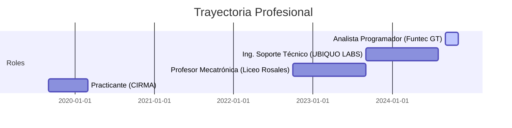
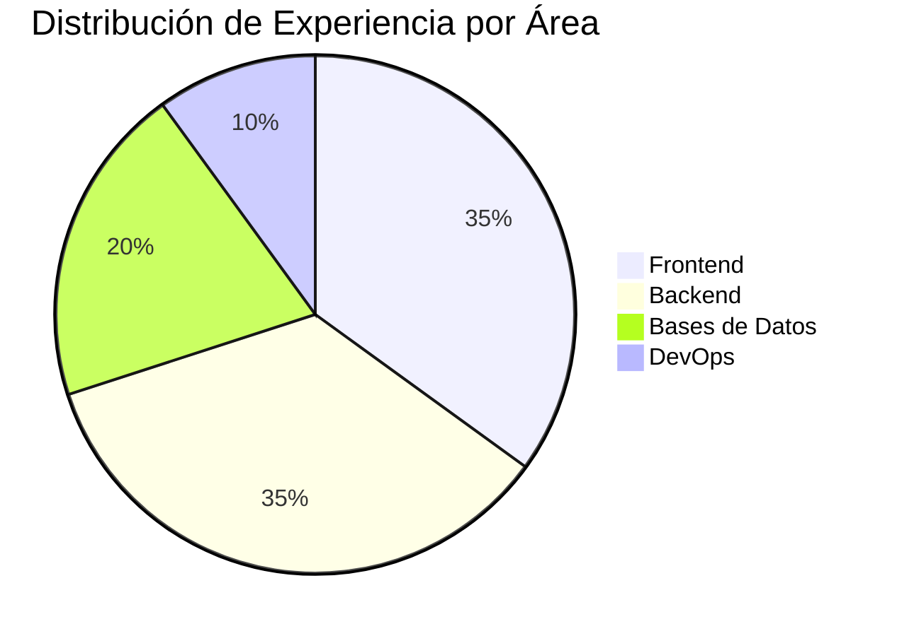

  <h1>¡Hola, soy José Galdámez! 👋</h1>
  
🚀 Mid Full Stack Developer | 🎓 Ingeniero en Ciencias y Sistemas (8º Semestre) | 💻 Especialista en React y Node.js

  
  <!-- Badges de tecnologías principales -->
  

    
    
    
    
    
  

  <!-- GitHub Stats Cards -->
  

    
    
  

## Sobre Mí 🌟
Soy un desarrollador Full Stack con experiencia comprobada en el desarrollo de aplicaciones web modernas y escalables. Como estudiante de octavo semestre en Ingeniería en Ciencias y Sistemas, combino mi formación académica con una sólida experiencia profesional en el desarrollo tanto frontend como backend. Mi pasión por la tecnología me impulsa a mantenerme constantemente actualizado con las últimas tendencias y mejores prácticas del desarrollo de software.

## Experiencia Profesional 📈

```mermaid
gantt
    title Trayectoria Profesional
    dateFormat  YYYY-MM
    section Roles
    Analista Programador (Funtec GT)      :active, 2024-09, 2024-11
    Ing. Soporte Técnico (UBIQUO LABS)    :2023-09, 2024-08
    Profesor Mecatrónica (Liceo Rosales)  :2022-10, 2023-09
    Practicante (CIRMA)                   :2019-09, 2020-03
```

## Nivel de Experiencia por Tecnología 📊

```mermaid
pie title Distribución de Experiencia por Área
    "Frontend" : 35
    "Backend" : 35
    "Bases de Datos" : 20
    "DevOps" : 10
```

## Stack Tecnológico 💻
<!-- Skills Cards with Progress Bars -->

### Frontend
   

### Backend
   

### Bases de Datos
   

<!-- GitHub Streak Stats -->

  

## Conéctate Conmigo 🤝

  
  
  

---

  
  <i>La programación no es solo mi trabajo, es mi pasión. Siempre buscando el próximo desafío tecnológico.</i>

